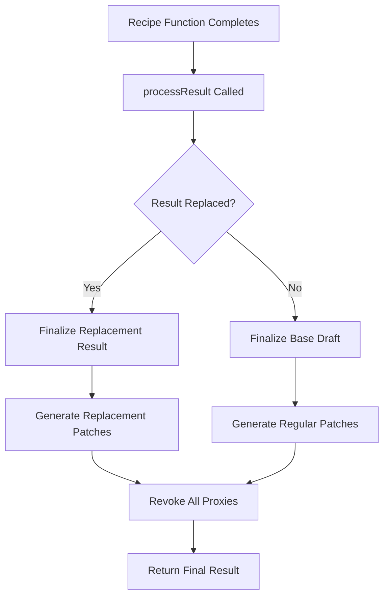
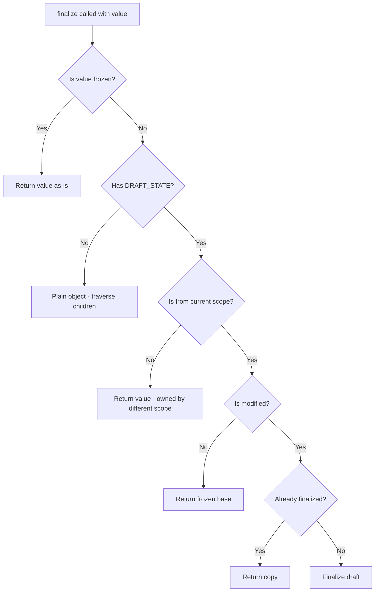
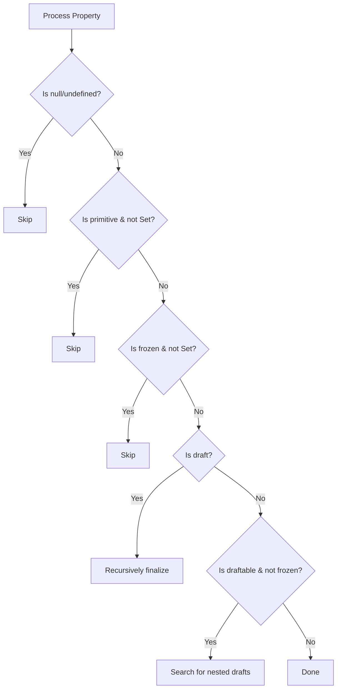
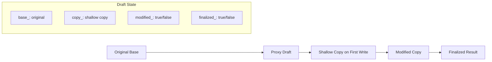
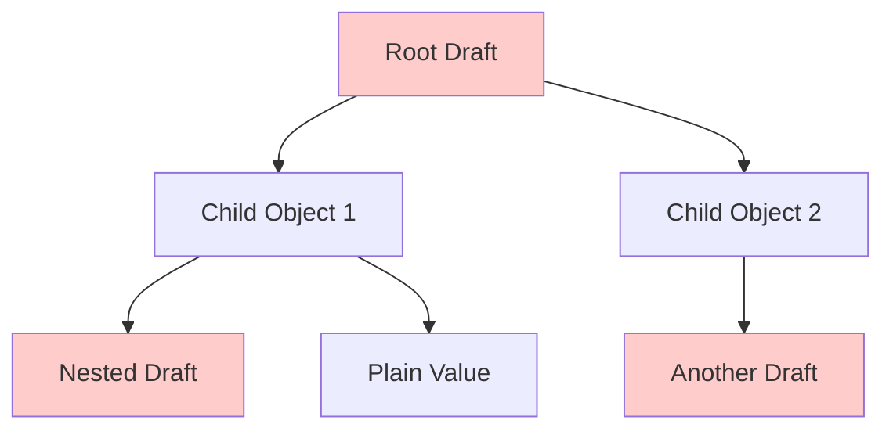
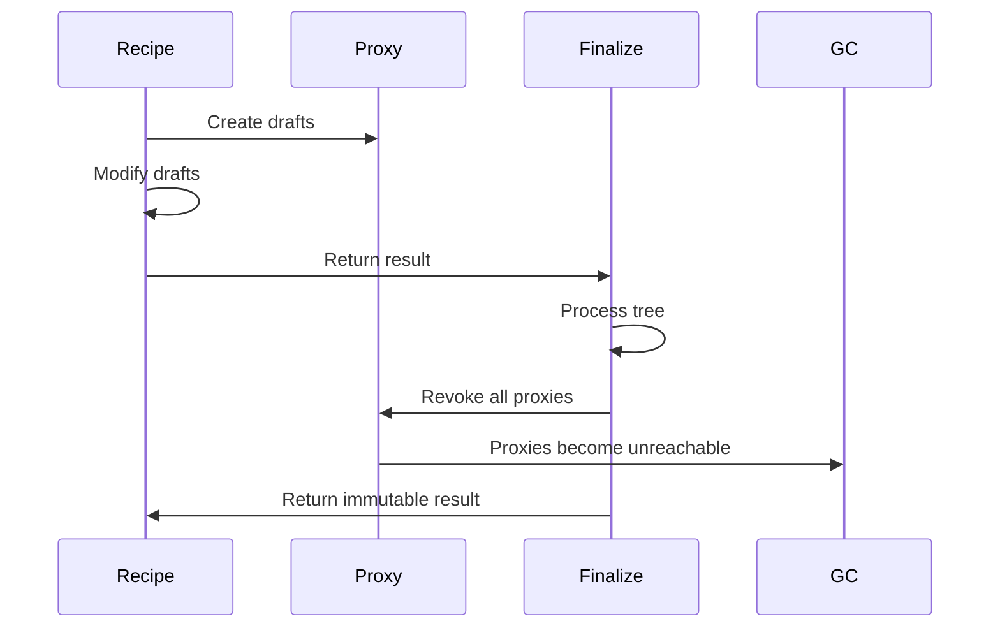

# Immer Finalization Process Explained

## Overview

The finalization process in Immer is responsible for converting the draft proxy tree back into a regular immutable object tree. It's a critical phase that happens after the recipe function completes, transforming all the proxy-wrapped drafts into final immutable values.

## High-Level Flow



## Step-by-Step Finalization Process

### 1. Entry Point: [`processResult()`](src/core/finalize.ts:22)

This is called from [`immerClass.ts`](src/core/immerClass.ts:109) after the recipe function completes.

**Key responsibilities:**

- Determines if the result was replaced entirely or if we're finalizing the modified draft tree
- Handles patch generation
- Manages proxy revocation
- Returns the final immutable result

```typescript
// Two main paths:
if (isReplaced) {
	// Recipe returned a completely new value
	result = finalize(scope, result)
} else {
	// Recipe modified the draft tree
	result = finalize(scope, baseDraft, [])
}
```

### 2. Core Finalization: [`finalize()`](src/core/finalize.ts:55)

This is the recursive heart of the finalization process.

**Input:** A value that could be:

- A draft proxy (needs finalization)
- A plain object containing drafts (needs traversal)
- A primitive or frozen value (return as-is)

**Process Flow:**



### 3. Draft Finalization Logic

When finalizing a modified draft:

```typescript
if (!state.finalized_) {
	state.finalized_ = true
	state.scope_.unfinalizedDrafts_--
	const result = state.copy_ // The shallow copy created during modification

	// Recursively finalize all children
	each(resultEach, (key, childValue) =>
		finalizeProperty(rootScope, state, result, key, childValue, path, isSet)
	)

	// Freeze the result
	maybeFreeze(rootScope, result, false)

	// Generate patches if needed
	if (path && rootScope.patches_) {
		generatePatches_(state, path, patches, inversePatches)
	}
}
```

### 4. Property Finalization: [`finalizeProperty()`](src/core/finalize.ts:122)

This handles individual properties during traversal:

**Decision Tree:**



**Key optimizations:**

- **Early returns** for primitives, nulls, and frozen values
- **Scope ownership check** - drafts from other scopes aren't finalized
- **Unfinalized draft counting** - stops traversal when no more drafts remain
- **Base comparison** - skips unchanged objects

### 5. Data Flow Through Draft States



**State transitions:**

1. **Creation**: `base_` points to original, `copy_` is null, `modified_` is false
2. **First write**: `copy_` created via [`prepareCopy()`](src/core/proxy.ts:281), `modified_` becomes true
3. **Finalization**: `finalized_` becomes true, `copy_` is recursively processed

### 6. Tree Traversal Strategy

The finalization performs a **depth-first traversal** of the entire object tree:



**Traversal rules:**

- **Drafts** (red): Finalized recursively, proxies revoked
- **Plain objects**: Traversed to find nested drafts
- **Primitives/Frozen**: Returned as-is
- **Cross-scope drafts**: Skipped (handled by their own scope)

### 7. Performance Optimizations

The current implementation includes several optimizations:

1. **Early termination**: When `unfinalizedDrafts_` reaches 0, stops traversing
2. **Frozen object skipping**: Frozen objects can't contain drafts
3. **Base comparison**: Objects unchanged from base are skipped
4. **Scope isolation**: Only finalizes drafts owned by current scope

### 8. Memory Management



**Key aspects:**

- **Proxy revocation**: All proxies are revoked via [`revokeScope()`](src/core/scope.ts:58)
- **Reference cleanup**: Draft references are nulled out
- **Freezing**: Final objects are frozen to prevent mutation

## Current Performance Issues

Based on the author's comment, the main architectural problems are:

1. **Full tree traversal**: Every finalization scans the entire result tree
2. **Deep pruning overhead**: Looking for accidentally retained drafts requires traversal
3. **Freezing cost**: Deep freezing is expensive but done to avoid future traversals

## The Proposed Alternative

The author suggests **"mark committed/final" instead of "revoke"**:

- Keep proxies in the final state but mark them as committed
- No need to scan/rewrite the final tree
- Trade-off: Proxies visible in debugger vs. performance gain
- Since all proxies in a scope are known, no tree traversal needed

This would fundamentally change the finalization from a **tree-rewriting process** to a **state-marking process**, potentially eliminating the expensive traversal entirely.

## How Current Draft Values Are Used

The finalization process makes extensive use of the draft state information:

1. **`state.base_`**: The original immutable value, returned for unmodified drafts
2. **`state.copy_`**: The shallow copy created on first write, becomes the finalized result
3. **`state.modified_`**: Determines whether to return base or process the copy
4. **`state.finalized_`**: Prevents double-processing of the same draft
5. **`state.assigned_`**: Used for patch generation to track which properties changed
6. **`scope.drafts_`**: Contains all drafts created in this scope for revocation
7. **`scope.unfinalizedDrafts_`**: Counter used for early termination optimization

The current architecture requires this full tree traversal because it needs to:

- Convert proxy objects back to plain objects
- Recursively process nested structures
- Handle the case where external objects might contain internal drafts
- Generate patches by comparing the tree structure
- Ensure all proxies are properly revoked for memory cleanup
