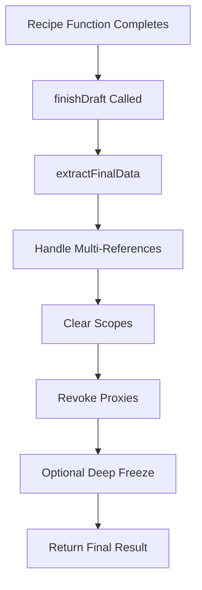
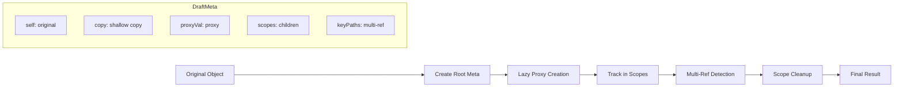
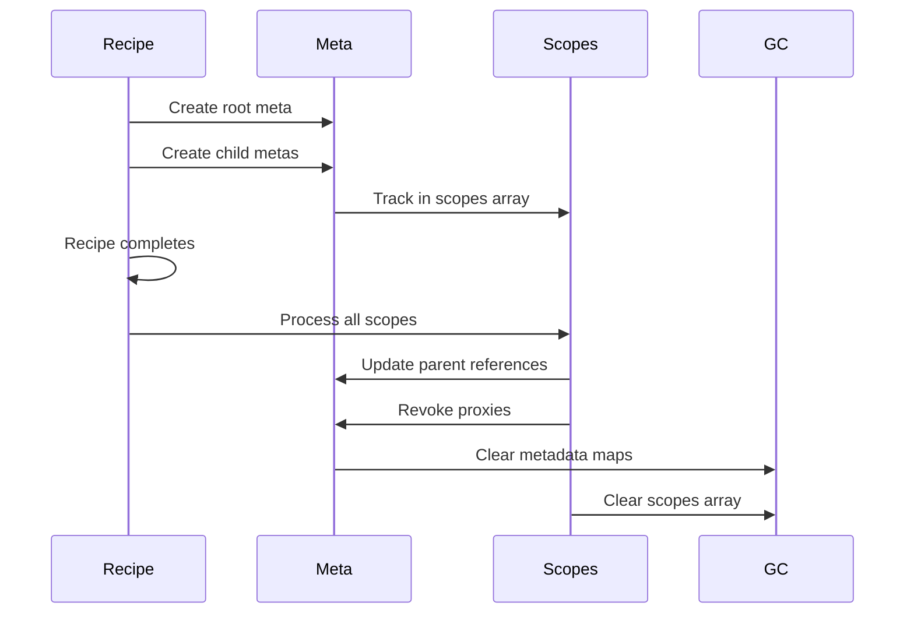

# Limu Finalization Process Explained

## Overview

Limu takes a sophisticated approach to finalization that combines **lazy proxy creation**, **scope-based tracking**, and **multi-reference handling**. Unlike other libraries, Limu uses a complex metadata system to track draft relationships and performs finalization through scope cleanup and reference resolution.

## High-Level Architecture



## Key Architectural Components

### 1. **Metadata System**

Limu uses extensive metadata tracking via [`DraftMeta`](../limu/src/inner-types.ts) objects:

```typescript
interface DraftMeta {
	id: string
	sourceId: string
	rootMeta: DraftMeta
	parentMeta: DraftMeta | null
	self: any // Original value
	copy: any // Shallow copy
	proxyVal: any // Proxy object
	modified: boolean // Modification flag
	keyPath: string[] // Path from root
	keyPaths: string[][] // Multiple paths (for multi-ref)
	scopes: DraftMeta[] // Child scopes
	// ... many more fields
}
```

### 2. **Scope-Based Tracking**

Each draft maintains a [`scopes`](../limu/src/core/scope.ts:167) array tracking all child drafts:

```typescript
export function recordVerScope(meta: DraftMeta) {
	meta.rootMeta.scopes.push(meta)
}
```

## Step-by-Step Finalization Process

### 1. Entry Point: [`finishDraft()`](../limu/src/core/build-limu-apis.ts:524)

```typescript
finishDraft: (proxyDraft: any, clearImmut?: boolean) => {
	const rootMeta = getSafeDraftMeta(proxyDraft, apiCtx)

	let final = extractFinalData(rootMeta, apiCtx, fast)
	if (autoFreeze && canFreezeDraft) {
		final = deepFreeze(final)
	}

	ROOT_CTX.delete(metaVer)
	FINISH_HANDLER_MAP.delete(proxyDraft)
	isDraftFinished = true
	return final
}
```

### 2. Core Finalization: [`extractFinalData()`](../limu/src/core/scope.ts:151)

```typescript
export function extractFinalData(
	rootMeta: DraftMeta,
	apiCtx: IApiCtx,
	fast: boolean
) {
	const {self, copy, modified} = rootMeta
	let final = self

	// Use copy if modified
	if (copy && modified) {
		final = rootMeta.copy
	}

	// Handle multi-references first
	if (!fast) {
		handleMultiRef(rootMeta, final)
	}

	// Then clear all scopes
	clearScopes(rootMeta, apiCtx)
	return final
}
```

### 3. **Multi-Reference Resolution**: [`handleMultiRef()`](../limu/src/core/scope.ts:103)

Limu's unique feature - handling objects referenced from multiple paths:

```typescript
export function handleMultiRef(rootMeta: DraftMeta, final: any) {
	const keyPathsList = getMultiRefPaths(rootMeta.sourceId)

	for (const keyPaths of keyPathsList) {
		let changedMeta: any = null
		const results: any[] = []

		for (const keyPath of keyPaths) {
			const {val} = getVal(rootMeta.proxyVal, keyPath)
			const valMeta = getDraftMeta(val)
			if (valMeta?.modified && !changedMeta) {
				changedMeta = valMeta
			}
			results.push(valMeta.self)
		}

		// Update all paths to point to the modified version
		if (changedMeta) {
			for (const keyPath of keyPaths) {
				setVal(final, keyPath, changedMeta.copy)
			}
		}
	}
}
```

### 4. **Scope Cleanup**: [`clearScopes()`](../limu/src/core/scope.ts:36)

```typescript
export function clearScopes(rootMeta: DraftMeta, apiCtx: IApiCtx) {
	const {metaMap} = apiCtx

	// Handle new nodes first
	apiCtx.newNodeMap.forEach(v => {
		const {node, parent, key} = v
		deepDrill(node, parent, key, (obj: any, parentObj: any, key: any) => {
			const meta = getDraftMetaByCtx(obj, apiCtx)
			if (meta) {
				const {modified, copy, self} = meta
				const targetNode = !modified ? self : copy
				parentObj[key] = targetNode
			}
		})
	})

	// Process all scopes
	rootMeta.scopes.forEach(meta => {
		const {modified, copy, parentMeta, key, self, revoke, proxyVal} = meta

		const leaveScope = () => {
			metaMap.delete(self)
			metaMap.delete(proxyVal)
			revoke()
		}

		if (!copy || !parentMeta) return leaveScope()

		const targetNode = !modified ? self : copy
		const parentCopy = parentMeta.copy
		const parentType = parentMeta.selfType

		// Handle different parent types
		if (parentType === MAP) {
			parentCopy.set(key, targetNode)
		} else if (parentType === SET) {
			parentCopy.delete(proxyVal)
			parentCopy.add(targetNode)
		} else if (parentType === ARRAY) {
			ressignArrayItem(parentMeta, meta, {targetNode, key})
		} else {
			parentCopy[key] = targetNode
		}

		leaveScope()
	})

	rootMeta.scopes.length = 0
}
```

## Data Flow Through Limu's System



## Key Performance Characteristics

### 1. **Lazy Proxy Creation**

Proxies are created only when accessed:

```typescript
// From getMayProxiedVal()
if (!valMeta) {
	valMeta = createScopedMeta(key, val, options)
	recordVerScope(valMeta)
}
return valMeta.proxyVal
```

### 2. **Scope-Based Finalization**

Instead of tree traversal, Limu processes tracked scopes:

```typescript
// Only processes tracked child drafts
rootMeta.scopes.forEach(meta => {
	// Finalize each scope
})
```

### 3. **Multi-Reference Optimization**

Handles complex reference patterns efficiently:

```typescript
// Detects when same object is referenced from multiple paths
// draft.a.shared = someObject;
// draft.b.shared = someObject; // Same reference detected
```

### 4. **Deep Drilling for New Nodes**

Uses [`deepDrill()`](../limu/src/core/scope.ts:50) to handle non-draft objects:

```typescript
deepDrill(node, parent, key, (obj: any, parentObj: any, key: any) => {
	const meta = getDraftMetaByCtx(obj, apiCtx)
	if (meta) {
		const targetNode = !modified ? self : copy
		parentObj[key] = targetNode
	}
})
```

## Memory Management



## Unique Features

### 1. **Multi-Reference Handling**

Limu uniquely handles cases where the same object is referenced from multiple paths:

```typescript
// This scenario is specifically optimized
draft.user.profile = someObject
draft.cache.profile = someObject // Same reference
```

### 2. **Path Tracking**

Maintains multiple path arrays for complex reference patterns:

```typescript
interface DraftMeta {
	keyPath: string[] // Primary path
	keyPaths: string[][] // All paths (multi-ref)
	keyStrPaths: string[][] // String versions
	arrKeyPaths: string[][] // Array-specific paths
}
```

### 3. **Scope Hierarchy**

Uses parent-child scope relationships for efficient cleanup:

```typescript
// Each meta knows its parent and children
parentMeta: DraftMeta | null;
scopes: DraftMeta[];  // All child scopes
```

## Performance Trade-offs

### **Advantages:**

- **Lazy proxy creation** - Only creates proxies when needed
- **Scope-based finalization** - No full tree traversal
- **Multi-reference optimization** - Handles complex patterns efficiently
- **Selective processing** - Only processes modified scopes

### **Potential Drawbacks:**

- **Complex metadata system** - High memory overhead per draft
- **Multi-reference tracking** - Additional complexity for edge cases
- **Deep drilling** - Performance cost for non-draft objects
- **Extensive bookkeeping** - Many metadata fields to maintain

## Comparison with Other Libraries

### **Limu vs Immer**

- **Limu**: Scope-based finalization with multi-reference handling
- **Immer**: Full tree traversal with proxy revocation

### **Limu vs Mutative**

- **Limu**: Complex metadata system with lazy proxy creation
- **Mutative**: Callback-based finalization with immediate updates

### **Limu vs Structura**

- **Limu**: Deferred finalization with scope cleanup
- **Structura**: Immediate finalization during mutations

## Architectural Summary

Limu's finalization approach is the most sophisticated among the libraries examined. It uses:

1. **Extensive metadata tracking** for complex reference patterns
2. **Scope-based cleanup** instead of tree traversal
3. **Multi-reference resolution** for shared object scenarios
4. **Lazy proxy creation** for performance optimization
5. **Deep drilling** for handling non-draft objects

This complexity allows Limu to handle edge cases that other libraries might struggle with, but at the cost of higher memory usage and implementation complexity. The approach is particularly well-suited for applications with complex object reference patterns and shared data structures.
