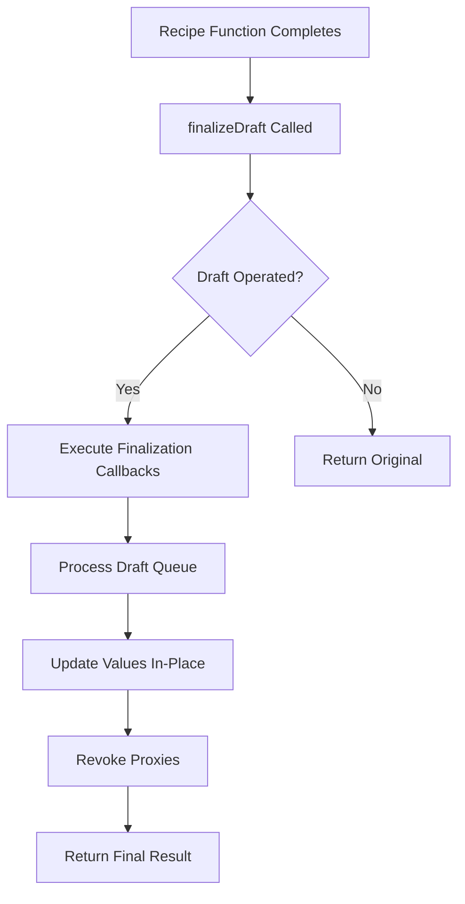
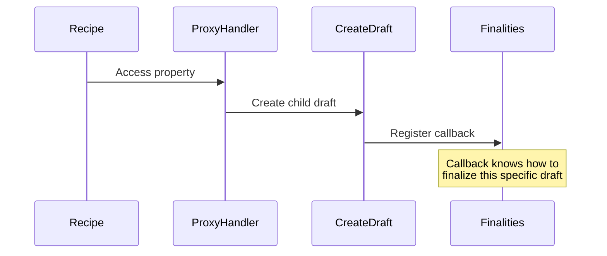
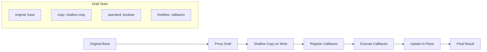
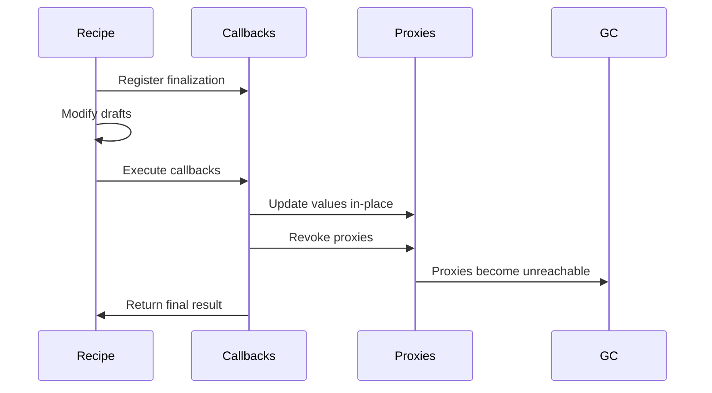

# Mutative Finalization Process Explained

## Overview

Mutative uses a fundamentally different finalization approach compared to Immer. Instead of performing a full tree traversal to convert proxies back to plain objects, Mutative uses a **callback-based finalization system** that processes only the modified parts of the draft tree.

## High-Level Architecture



## Key Architectural Differences from Immer

### 1. **Callback-Based Finalization**

Instead of tree traversal, Mutative registers finalization callbacks during draft creation:

```typescript
// From createDraft() - lines 259-285
target.finalities.draft.push((patches, inversePatches) => {
	const draft = get(copy, key!)
	const proxyDraft = getProxyDraft(draft)
	if (proxyDraft) {
		let updatedValue = proxyDraft.operated
			? getValue(draft)
			: proxyDraft.original
		set(copy, key!, updatedValue)
	}
})
```

### 2. **Finalities System**

Mutative uses a [`Finalities`](../mutative/src/interface.ts:31) object to track finalization tasks:

```typescript
interface Finalities {
	draft: ((patches?, inversePatches?) => void)[] // Finalization callbacks
	revoke: (() => void)[] // Proxy revocation functions
	handledSet: WeakSet<any> // Prevents duplicate processing
}
```

## Step-by-Step Finalization Process

### 1. Entry Point: [`finalizeDraft()`](../mutative/src/draft.ts:299)

```typescript
export function finalizeDraft<T>(
	result: T,
	returnedValue: [T] | [],
	patches?: Patches,
	inversePatches?: Patches,
	enableAutoFreeze?: boolean
) {
	const proxyDraft = getProxyDraft(result)
	if (proxyDraft?.operated) {
		// Execute all registered finalization callbacks
		while (proxyDraft.finalities.draft.length > 0) {
			const finalize = proxyDraft.finalities.draft.pop()!
			finalize(patches, inversePatches)
		}
	}
	// Revoke proxies and return final state
}
```

### 2. Callback Registration During Draft Creation

When a draft is created, finalization callbacks are registered:



### 3. **Selective Processing** vs Full Tree Traversal

**Mutative's approach:**

- Only processes drafts that were actually modified (`proxyDraft.operated`)
- Uses callbacks registered during draft creation
- No recursive tree walking needed

**Immer's approach:**

- Traverses entire result tree
- Checks every node for draft state
- Processes all nodes regardless of modification

### 4. **In-Place Value Updates**

Mutative updates values directly in the copy objects:

```typescript
// From markFinalization() - lines 122-138
proxyDraft.callbacks.push((patches, inversePatches) => {
	const copy = target.type === DraftType.Set ? target.setMap : target.copy
	if (isEqual(get(copy, key), value)) {
		let updatedValue = proxyDraft.copy || proxyDraft.original
		// Direct update - no tree rewriting
		set(copy, key, updatedValue)
	}
})
```

### 5. **Lazy Finalization with handleValue()**

For non-draft values that might contain drafts, Mutative uses [`handleValue()`](../mutative/src/utils/finalize.ts:15):

```typescript
export function handleValue(
	target: any,
	handledSet: WeakSet<any>,
	options?: ProxyDraft["options"]
) {
	// Early returns for optimization
	if (
		isDraft(target) ||
		!isDraftable(target) ||
		handledSet.has(target) ||
		Object.isFrozen(target)
	)
		return

	// Only process if contains drafts
	forEach(target, (key, value) => {
		if (isDraft(value)) {
			const proxyDraft = getProxyDraft(value)!
			const updatedValue = proxyDraft.operated
				? proxyDraft.copy
				: proxyDraft.original
			set(target, key, updatedValue)
		} else {
			handleValue(value, handledSet, options) // Recursive only when needed
		}
	})
}
```

## Data Flow Through Mutative's System



## Performance Optimizations

### 1. **No Full Tree Traversal**

- Only processes modified drafts
- Uses registered callbacks instead of searching

### 2. **Early Termination**

- [`handledSet`](../mutative/src/interface.ts:34) prevents duplicate processing
- Frozen objects are skipped immediately

### 3. **Minimal Proxy Revocation**

- Only revokes proxies that were actually created
- Tracked in [`finalities.revoke`](../mutative/src/interface.ts:33) array

### 4. **Selective Deep Processing**

- [`handleValue()`](../mutative/src/utils/finalize.ts:15) only recurses when objects contain drafts
- Uses WeakSet to track processed objects

## Memory Management



## Key Architectural Advantages

### 1. **Callback-Driven vs Tree-Walking**

- **Mutative**: Knows exactly what to finalize through registered callbacks
- **Immer**: Must search entire tree to find what needs finalization

### 2. **Selective Processing**

- **Mutative**: Only processes [`operated`](../mutative/src/interface.ts:39) drafts
- **Immer**: Processes entire result tree regardless of modifications

### 3. **In-Place Updates**

- **Mutative**: Updates values directly in existing copy objects
- **Immer**: Creates new object tree during finalization

### 4. **Lazy Deep Processing**

- **Mutative**: [`handleValue()`](../mutative/src/utils/finalize.ts:15) only recurses when necessary
- **Immer**: Always performs deep traversal

## Finalization Phases

### Phase 1: Callback Execution

```typescript
while (proxyDraft.finalities.draft.length > 0) {
	const finalize = proxyDraft.finalities.draft.pop()!
	finalize(patches, inversePatches)
}
```

### Phase 2: State Resolution

```typescript
const state = hasReturnedValue
	? returnedValue[0]
	: proxyDraft?.operated
	? proxyDraft.copy // Use modified copy
	: proxyDraft.original // Use original if unmodified
```

### Phase 3: Cleanup

```typescript
if (proxyDraft) revokeProxy(proxyDraft)
if (enableAutoFreeze) {
	deepFreeze(state, state, proxyDraft?.options.updatedValues)
}
```

## Performance Impact

This architecture eliminates the main performance bottlenecks of Immer's approach:

1. **No full tree traversal** - Only modified parts are processed
2. **No tree rewriting** - Values are updated in-place
3. **Minimal recursion** - Only when objects actually contain drafts
4. **Efficient tracking** - Uses WeakSet and callback registration

The result is significantly faster finalization, especially for large objects with small modifications, which explains Mutative's performance advantages over Immer in benchmarks.
