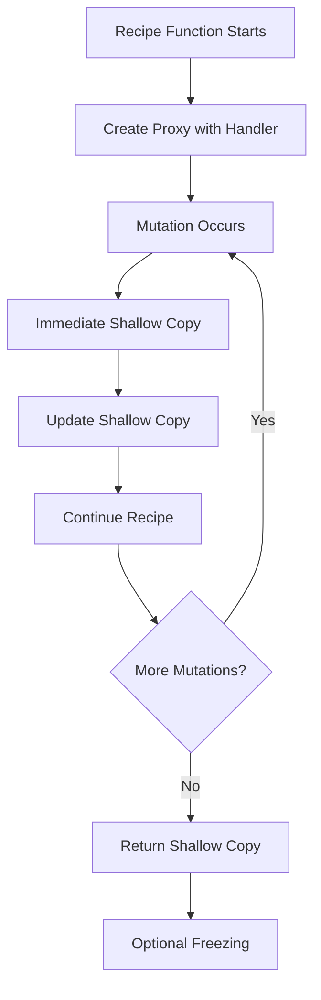
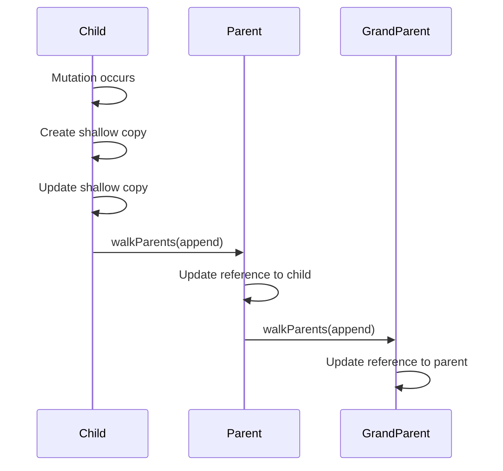
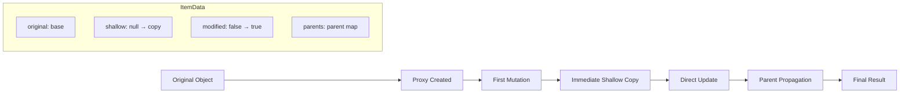
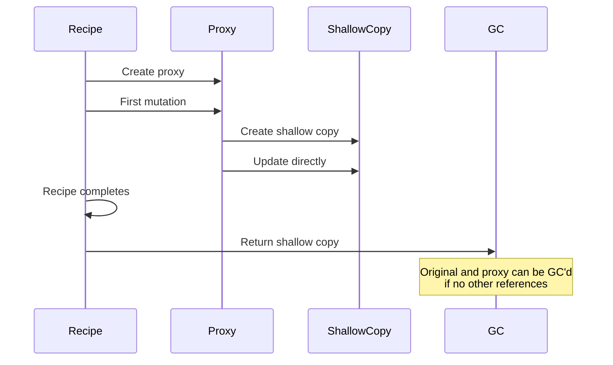

# Structura Finalization Process Explained

## Overview

Structura takes a radically different approach to finalization compared to both Immer and Mutative. Instead of having a separate finalization phase, Structura uses **immediate shallow copying** and **direct state updates** during mutations, essentially eliminating the need for traditional finalization altogether.

## High-Level Architecture



## Key Architectural Principle: **No Finalization Phase**

Unlike Immer and Mutative, Structura doesn't have a separate finalization step. Instead, it uses:

1. **Immediate shallow copying** on first mutation
2. **Direct updates** to the shallow copy
3. **Parent propagation** through [`walkParents()`](../structura.js/src/internals/walkParents.ts:31)

## Step-by-Step Process

### 1. Entry Point: [`produce()`](../structura.js/src/core/produce.ts:46)

```typescript
export function produce<T, Q, IS_ASYNC = false>(
	state: DraftableState<T>,
	producer: Producer<T, Q, IS_ASYNC>,
	patchCallback?: PatchCallback<T>,
	{proxify = createProxy}: ProduceOptions = {}
): ProduceReturn<T, Q, IS_ASYNC>
```

**Key aspects:**

- Creates a [`WeakMap`](../structura.js/src/core/produce.ts:66) to track all draft data
- Uses [`CreateProxyHandler`](../structura.js/src/proxy/proxyHandler.ts:33) for proxy operations
- Calls [`processResult()`](../structura.js/src/core/produce.ts:82) at the end

### 2. Proxy Creation: [`createProxy()`](../structura.js/src/proxy/createProxy.ts:20)

```typescript
export const createProxy = function (
  obj: object,
  data: AllData,
  handler: ProxyHandler<object>,
  parent?: object,
  link?: Link
): ItemData
```

**Creates [`ItemData`](../structura.js/src/proxy/createProxy.ts:6) structure:**

```typescript
type ItemData = {
	proxy: object
	type: string
	original: object
	shallow: object | null // Initially null, created on first mutation
	parents: ParentMap // Tracks parent-child relationships
	modified: boolean // Tracks if object was mutated
}
```

### 3. **Immediate Finalization** During Mutations

When a mutation occurs, [`walkParents()`](../structura.js/src/internals/walkParents.ts:31) is called:

```typescript
export function walkParents(
	mainState: unknown,
	action: Actions,
	data: AllData,
	patchStore: PatchStore | null,
	t: object,
	p?: Prop,
	v?: unknown,
	links?: LinkMap,
	prevPatches?: PatchPair[]
)
```

**Key finalization logic:**

```typescript
if (!itemData.modified) {
	itemData.modified = true
	if (shallow === null) {
		// Immediate shallow copy on first mutation
		shallow = itemData.shallow = shallowClone(t, type as Types)
	}
}
```

### 4. **Direct State Updates**

Instead of deferring updates, Structura immediately updates the shallow copy:

```typescript
if (action === Actions.set) {
	const actualValue = target(v)
	;(shallow as UnknownObj)[p as Prop] = actualValue
} else if (action === Actions.delete) {
	delete (shallow as UnknownObj)[p as Prop]
} else if (action === Actions.set_map) {
	;(shallow as UnknownMap).set(p, actualValue)
}
// ... etc for other actions
```

### 5. **Parent Propagation**

Changes propagate up the parent chain immediately:



### 6. **Result Processing**: [`processResult()`](../structura.js/src/core/produce.ts:82)

```typescript
function processResult(result: void | Q | typeof NOTHING) {
	const produced = itemData.modified ? itemData.shallow : unwrapState
	const hasReturn = typeof result !== "undefined"

	// Handle patches if needed
	if (patchCallback && pStore) {
		// Generate patches from stored operations
	}

	// Optional freezing
	if (Settings.autoFreeze) {
		freeze(unwrapState, true, true)
		freeze(processed, true, true)
	}

	return processed
}
```

## Data Flow Through Structura's System



## Performance Characteristics

### 1. **No Tree Traversal**

- No finalization phase means no tree walking
- Updates happen immediately during mutations

### 2. **Minimal Object Creation**

- Only creates shallow copies when objects are actually modified
- Unmodified objects remain as references to originals

### 3. **Efficient Parent Tracking**

- Uses [`ParentMap`](../structura.js/src/proxy/createProxy.ts:18) to track relationships
- Enables efficient propagation without searching

### 4. **Lazy Shallow Copying**

```typescript
// Only creates shallow copy on first mutation
if (!itemData.modified) {
	itemData.modified = true
	if (shallow === null) {
		shallow = itemData.shallow = shallowClone(t, type as Types)
	}
}
```

## Comparison with Other Libraries

### **Structura vs Immer**

- **Structura**: No finalization phase, immediate updates
- **Immer**: Full tree traversal during finalization

### **Structura vs Mutative**

- **Structura**: Direct shallow copy updates
- **Mutative**: Callback-based finalization system

### **Structura's Unique Approach**

- **Immediate finalization**: Updates happen during mutations, not after
- **Direct state management**: No proxy-to-plain-object conversion needed
- **Parent-aware updates**: Changes propagate up immediately

## Memory Management



## Key Advantages

### 1. **Eliminates Finalization Overhead**

- No separate finalization phase
- No tree traversal required
- No proxy revocation needed

### 2. **Predictable Performance**

- Performance scales with number of mutations, not object size
- No hidden finalization costs

### 3. **Simple Mental Model**

- Mutations immediately create and update shallow copies
- What you mutate is what you get

### 4. **Efficient Memory Usage**

- Only modified objects are shallow copied
- Unmodified parts remain as references

## Architectural Trade-offs

### **Advantages:**

- Fastest finalization (none needed)
- Predictable performance characteristics
- Simple implementation

### **Potential Drawbacks:**

- Immediate shallow copying on first mutation
- More complex parent tracking system
- Less flexibility in finalization strategies

This architecture explains why Structura claims to be "10 times or more faster than Immer" - by eliminating the finalization phase entirely and performing updates immediately during mutations, it avoids the primary performance bottleneck that affects both Immer and Mutative.
