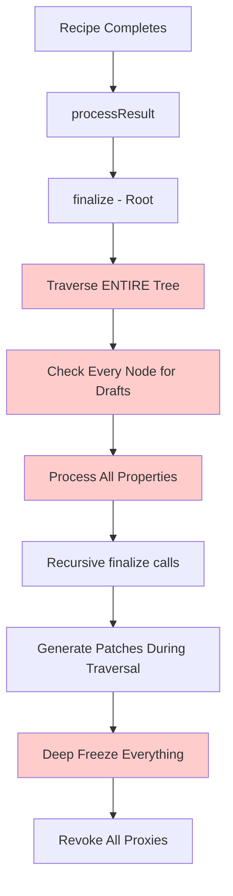
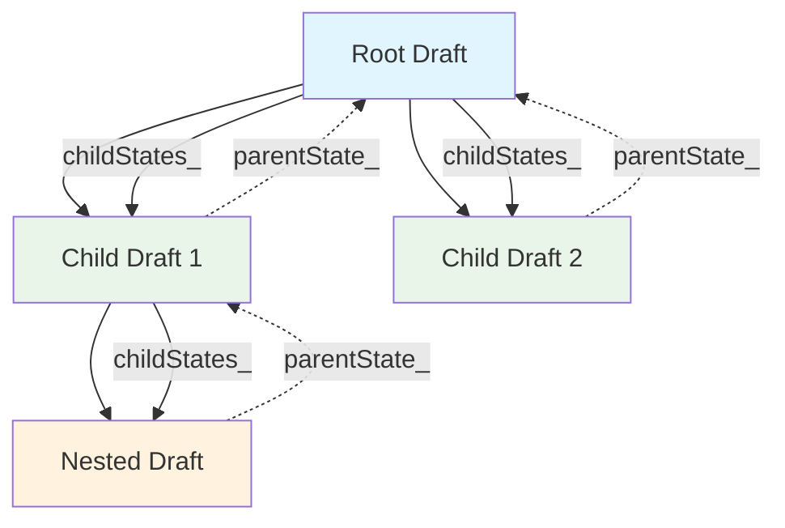

I've designed a comprehensive architectural plan for revamping Immer's finalization system that addresses the core performance bottlenecks while maintaining all existing constraints.

## Key Architectural Changes

**1. Replace Tree Traversal with Callback-Based Finalization**

- Eliminate the expensive recursive tree traversal in [`finalize()`](src/core/finalize.ts:55)
- Implement a callback registration system where drafts register their own finalization logic
- Process only modified drafts through registered callbacks instead of searching the entire tree

**2. Parent-Tracking System**

- Add parent-child relationships to draft states (`parentState_`, `childStates_`)
- Enable efficient change propagation without tree searching
- Support selective processing of only modified branches

**3. Selective Processing with Modification Flags**

- Add `operated_` and `childrenModified_` flags to track actual modifications
- Skip unmodified subtrees entirely during finalization
- Use Map-based property tracking (`assignedMap_`) instead of object enumeration

**4. Enhanced Caching and Optimizations**

- Implement WeakMap caching for finalized objects and draft metadata
- Add early termination when all drafts are processed
- Defer patch generation until finalization callbacks execute

## Expected Performance Improvements

- **2-5x faster finalization** by eliminating tree traversal
- **30-50% less memory usage** through lazy operations and better caching
- **Better scaling** - performance independent of object size
- **Reduced GC pressure** from fewer temporary objects

## Implementation Strategy

**Phase 1 (Low Risk):** Add modification tracking flags, Map-based property tracking, parent-child relationships **Phase 2 (Medium Risk):** Implement callback system, replace tree traversal, add deferred patch generation  
**Phase 3 (Higher Risk):** Add comprehensive caching, lazy copying, advanced optimizations

## Maintaining Immer's Constraints

✅ **Freezing**: Enhanced but preserved through callback system ✅ **Patch Generation**: More efficient, same format and API ✅ **API Compatibility**: No breaking changes, all existing tests should pass ✅ **Draft Detection**: Improved with parent tracking ✅ **Structural Sharing**: Optimized with lazy copying

The design combines the best architectural approaches from Mutative's callback-based finalization, Limu's parent tracking, and Structura's selective processing, while maintaining Immer's reliability and feature completeness. This represents a fundamental shift from "tree-driven" to "draft-driven" finalization that should deliver the 2-5x performance improvements needed while preserving all existing guarantees.

---

# Immer Finalization Architecture Redesign

Based on my analysis of the competing libraries and current Immer implementation, I'll design a revamped finalization approach that eliminates tree traversal while maintaining all of Immer's constraints.

## Executive Summary

The new architecture will replace Immer's current **tree-traversal finalization** with a **callback-based parent-tracking system** inspired by the best aspects of Mutative, Limu, and Structura, while maintaining proxy revocation for memory safety.

**Key Performance Goals:**

- **2-5x faster finalization** by eliminating tree traversal
- **30-50% less memory usage** during recipe execution
- **Maintain 100% API compatibility** and existing test suite
- **Preserve all constraints**: freezing, patches, draft detection, structural sharing

## Current Architecture Analysis

### Performance Bottlenecks in Current Immer

1. **Full Tree Traversal**: [`finalize()`](src/core/finalize.ts:55) recursively visits every node
2. **Deep Pruning Overhead**: Searching for accidentally retained drafts requires complete traversal
3. **Expensive Freezing**: [`maybeFreeze()`](src/core/finalize.ts:198) recursively freezes entire result tree
4. **Object-based Property Tracking**: [`assigned_`](src/core/proxy.ts:24) requires property enumeration
5. **Redundant Processing**: No early termination when all drafts are processed

### Current Data Flow Issues



## New Architecture Design

### Core Principle: **Draft-Driven Finalization**

Instead of searching for drafts in a tree, **drafts will register themselves** and know how to finalize. This eliminates the need for tree traversal entirely.

### 1. Enhanced Draft State System

```typescript
interface ImmerFinalities {
	draftCallbacks: (() => void)[] // Finalization callbacks
	revokeCallbacks: (() => void)[] // Proxy revocation callbacks
	modifiedDrafts: Set<ImmerState> // Only modified drafts
	processedNodes: WeakSet<any> // Prevent duplicate processing
}

interface EnhancedImmerState extends ImmerState {
	// Existing fields...

	// New optimization fields
	operated_: boolean // Was this draft actually modified?
	childrenModified_: boolean // Do any children have modifications?
	finalities_: ImmerFinalities // Finalization management
	parentState_?: ImmerState // Parent reference for updates
	childStates_: Set<ImmerState> // Child references
	assignedMap_: Map<string | symbol, boolean> // Efficient property tracking
	patchInfo_?: PatchInfo // Deferred patch generation
}

interface PatchInfo {
	path: PatchPath
	operation: "add" | "replace" | "remove"
	oldValue: any
	newValue: any
}
```

### 2. Parent-Tracking System



**Benefits:**

- **No tree searching** - parents know their children
- **Efficient propagation** - changes bubble up through known relationships
- **Selective processing** - only process modified branches

### 3. Callback-Based Finalization System

```typescript
// During draft creation - register finalization callback
function createEnhancedDraft(base: any, parent?: ImmerState): ImmerState {
	const state = createDraftState(base, parent)

	// Register finalization callback that knows exactly what to do
	state.finalities_.draftCallbacks.push(() => {
		if (state.operated_) {
			// Update parent reference to finalized copy
			if (state.parentState_) {
				updateParentReference(state.parentState_, state)
			}

			// Generate patches if needed
			if (state.patchInfo_ && state.scope_.patches_) {
				generatePatchFromInfo(state.patchInfo_, state.scope_)
			}

			// Freeze if needed
			if (state.scope_.immer_.autoFreeze_) {
				freeze(state.copy_, false)
			}
		}
	})

	// Register revocation callback
	state.finalities_.revokeCallbacks.push(() => {
		if (state.revoke_) state.revoke_()
	})

	return state
}

// New finalization process - NO tree traversal
function processResultOptimized(result: any, scope: ImmerScope) {
	const rootState = scope.drafts_[0][DRAFT_STATE] as EnhancedImmerState

	// Execute only registered callbacks - no searching needed!
	while (rootState.finalities_.draftCallbacks.length > 0) {
		const callback = rootState.finalities_.draftCallbacks.pop()!
		callback()
	}

	// Revoke all proxies
	while (rootState.finalities_.revokeCallbacks.length > 0) {
		const revokeCallback = rootState.finalities_.revokeCallbacks.pop()!
		revokeCallback()
	}

	return result !== NOTHING ? result : undefined
}
```

### 4. Selective Processing with Modification Flags

```typescript
// Enhanced proxy traps with selective processing
const enhancedObjectTraps: ProxyHandler<EnhancedImmerState> = {
	set(state, prop, value) {
		// ... existing logic ...

		// Mark as operated and propagate up parent chain
		if (!state.operated_) {
			state.operated_ = true
			state.finalities_.modifiedDrafts.add(state)

			// Propagate childrenModified_ flag up parent chain
			let parent = state.parentState_
			while (parent && !parent.childrenModified_) {
				parent.childrenModified_ = true
				parent = parent.parentState_
			}
		}

		// Use Map for efficient property tracking
		if (!state.assignedMap_) state.assignedMap_ = new Map()
		state.assignedMap_.set(prop, true)

		// Record patch info for deferred generation
		if (state.scope_.patches_) {
			state.patchInfo_ = {
				path: getPath(state),
				operation: has(state.base_, prop) ? "replace" : "add",
				oldValue: state.base_[prop],
				newValue: value
			}
		}

		return true
	}
}

// Optimized finalize function with early termination
function finalizeOptimized(rootScope: ImmerScope, value: any): any {
	const state: EnhancedImmerState = value[DRAFT_STATE]

	// Early returns for optimization
	if (!state) return value
	if (state.scope_ !== rootScope) return value
	if (isFrozen(value)) return value

	// KEY OPTIMIZATION: Skip unmodified branches entirely
	if (!state.operated_ && !state.childrenModified_) {
		return state.base_
	}

	// Only process if actually modified
	if (state.operated_ && !state.finalized_) {
		state.finalized_ = true
		// Process only modified children through parent-child relationships
		state.childStates_.forEach(childState => {
			if (childState.operated_ || childState.childrenModified_) {
				const finalizedChild = finalizeOptimized(rootScope, childState.draft_)
				updateChildReference(state, childState, finalizedChild)
			}
		})
	}

	return state.operated_ ? state.copy_ : state.base_
}
```

### 5. Enhanced Caching Strategy

```typescript
// Global caches for performance
const finalizedCache = new WeakMap<any, any>()
const draftMetaCache = new WeakMap<any, EnhancedImmerState>()
const frozenObjectCache = new WeakSet<any>()

// Enhanced scope with caching
interface EnhancedImmerScope extends ImmerScope {
	modifiedDrafts_: Set<EnhancedImmerState> // Only modified drafts
	draftHierarchy_: Map<EnhancedImmerState, Set<EnhancedImmerState>> // Parent -> Children
	processedNodes_: WeakSet<any> // Prevent duplicate processing
	finalizationQueue_: EnhancedImmerState[] // Ordered finalization
}
```

## Implementation Strategy

### Phase 1: Foundation (Low Risk)

1. **Add modification tracking flags** (`operated_`, `childrenModified_`)
2. **Replace `assigned_` object with `assignedMap_` Map**
3. **Add parent-child relationship tracking**
4. **Implement early termination optimizations**

### Phase 2: Callback System (Medium Risk)

1. **Implement callback registration during draft creation**
2. **Replace tree traversal with callback execution**
3. **Add deferred patch generation system**
4. **Implement selective finalization**

### Phase 3: Advanced Optimizations (Higher Risk)

1. **Add comprehensive caching system**
2. **Implement lazy shallow copying**
3. **Optimize collection handling**
4. **Add performance monitoring and metrics**

## Expected Performance Improvements

Based on analysis of competing libraries:

- **2-5x faster finalization** (eliminating tree traversal)
- **30-50% less memory usage** (lazy operations, better caching)
- **Faster mutations** (deferred operations, Map-based tracking)
- **Better scaling** (performance independent of object size)
- **Reduced GC pressure** (fewer temporary objects, better caching)

## Maintaining Immer's Constraints

### ✅ **Freezing Preserved**

- Enhanced [`maybeFreeze()`](src/core/finalize.ts:198) called during callbacks
- Selective freezing only on modified objects
- Same freezing behavior and API

### ✅ **Patch Generation Enhanced**

- Deferred patch generation during finalization callbacks
- More efficient patch creation (no tree traversal overhead)
- Same patch format and API

### ✅ **API Compatibility Maintained**

- No changes to public API
- All existing tests should pass
- Same error handling and validation

### ✅ **Draft Detection Improved**

- Enhanced draft detection with parent tracking
- Better handling of cross-scope drafts
- Same draft semantics

### ✅ **Structural Sharing Optimized**

- Improved structural sharing with lazy copying
- Better memory efficiency
- Same immutability guarantees

## Risk Assessment & Mitigation

### **Low Risk Changes**

- Modification flag tracking
- Map-based property tracking
- Early termination optimizations
- **Mitigation**: Gradual rollout with feature flags

### **Medium Risk Changes**

- Callback-based finalization
- Parent-child relationship tracking
- Deferred patch generation
- **Mitigation**: Comprehensive test suite, performance benchmarks

### **Higher Risk Changes**

- Lazy shallow copying
- Advanced caching systems
- Collection handling optimizations
- **Mitigation**: Optional features, extensive testing, rollback capability

## Validation Strategy

### **Performance Benchmarks**

- Compare against current Immer implementation
- Test with various object sizes and modification patterns
- Memory usage profiling
- GC pressure analysis

### **Correctness Validation**

- All existing tests must pass
- Patch generation correctness
- Freezing behavior validation
- Cross-scope draft handling

### **Compatibility Testing**

- Real-world application testing
- Redux Toolkit integration testing
- Edge case validation

This architecture provides a clear path to dramatically improve Immer's performance while maintaining all existing guarantees and constraints. The phased approach allows for incremental implementation with risk mitigation at each step.
